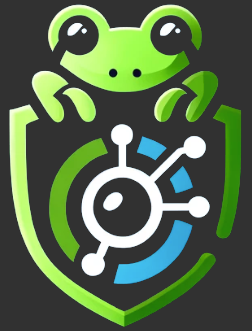
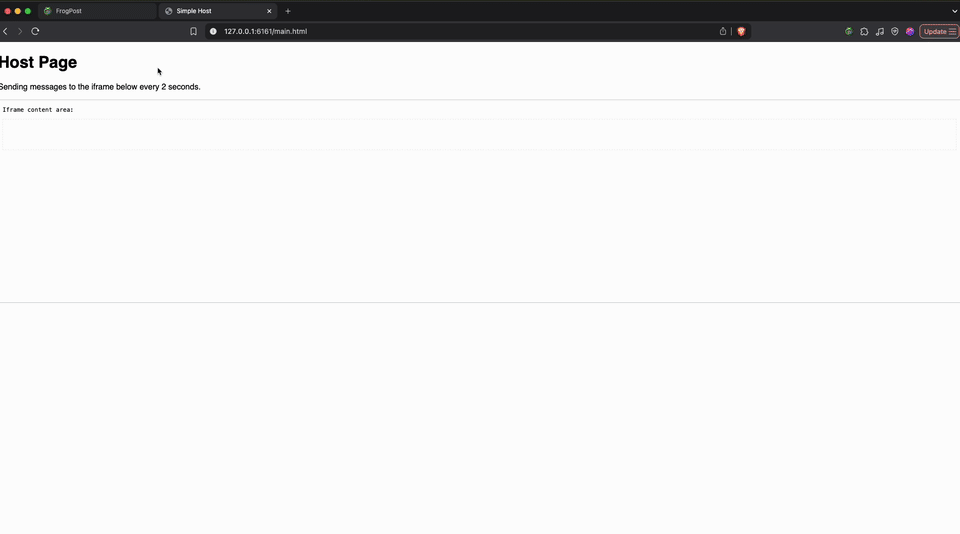

# FrogPost: postMessage Security Testing Tool

FrogPost is a powerful Chrome extension for testing and analyzing the security of `postMessage` communications between iframes. It helps developers and security professionals identify vulnerabilities in message-handling implementations.

#### Current Version: FrogPost v1.0.6

<p align="center" width="100%">
    
</p>

## Preview
<p align="center" width="100%">
    
</p>

---

## ⚠️ Security Disclaimer

Use FrogPost **ethically and legally** — only test applications you own or have permission to assess. Unauthorized testing may violate laws.

---

## 🚀 Key Features

- Live monitor of cross-origin `postMessage` traffic
- Automatic detection and analysis of message handlers
- Static and runtime analysis for DOM-based vulnerabilities
- Identification of missing origin checks and unsafe sinks
- Targeted fuzzing of insecure handlers
- Detailed security reports with payload suggestions

---

## 📌 Usage Highlights

1. **Observe**: Load any site with iframes. FrogPost captures `postMessage` exchanges.
2. **Analyze**: Click ▶ to begin handler analysis. Static fallback analysis is applied if runtime fails.
3. **Trace**: Use ✨ to trace data flows, detect DOM sinks, and generate security payloads.
4. **Fuzz**: Launch 🚀 to test vulnerable endpoints using crafted fuzzing payloads.

---

## 🧠 Dashboard at a Glance

### 🎯 Per-Iframe Controls

- **▶ Play** – Start handler detection and capture
- **✨ Trace** – Static sink and flow analysis
- **📋 Report** – Show results & recommendations
- **🚀 Launch** – Begin fuzzing vulnerable handlers

### 🛠️ General Controls

- **Check All** – Analyze all endpoints
- **Clear Messages** – Reset state and logs
- **Export** – Download captured messages
- **Refresh** – Manually update messages
- **Debug Toggle** – Verbose logging in console

### 💬 Message Controls

- **→ Send to Origin** – Replay to sender
- **→ Send to Destination** – Replay to receiver

---

## 📊 Panels

- **Hosts Panel** – Shows the main page and iframe connections
- **Messages Panel** – Intercepted `postMessage` traffic
- **Security Report** – DOM XSS and origin check findings

---

## 📥 Installation Guide for macOS

### Option 1 (Recommended): Install the Chrome Extension via `setup.sh`

1. Clone the repository:

    ```
    git clone https://github.com/thisis0xczar/FrogPost.git
    ```

2. Load the extension in Chrome.

3. `cd` to the repo folder:

    ```
    cd FrogPost
    ```

4. Make `setup.sh` executable and run it:

    ```
    chmod +x setup.sh; ./setup.sh
    ```

### Option 2: Install the Chrome Extension manually

1. Clone the repository:

    ```
    git clone https://github.com/thisis0xczar/FrogPost.git
    ```

2. Go to `chrome://extensions/` in Chrome

3. Enable **Developer mode**

4. Click **Load unpacked** and select the FrogPost directory

5. Extension should appear in Chrome

---

### Step 2: Set Up the Native Messaging Host

1. Create required directories:

    ```
    mkdir -p ~/Library/Application\ Support/NodeServerStarter
    mkdir -p ~/Library/Application\ Support/Google/Chrome/NativeMessagingHosts
    ```

2. Copy your Chrome Extension ID and update `com.nodeserver.starter.json`:

    ```
    sed -i '' 's/\abcdefghijklmnopabcdefghijklmnop/<your-extension-id>/g' com.nodeserver.starter.json
    ```

3. Verify `allowed_origins` includes:

    ```
    "chrome-extension://<your-extension-id>/"
    ```

4. In `server.js`, set:

    ```js
    const rootDir = '/Path/To/extension/folder';
    ```

5. In `start_server.sh`, set:

    ```bash
    SERVER_JS="/Users/[USER_NAME]/Library/Application Support/NodeServerStarter/server.js"
    LOG_FILE="/Users/[USER_NAME]/Library/Application Support/NodeServerStarter/node-finder.log
    ```

6. Copy files to system paths:

    ```bash
    cp /path/to/FrogPost/server.js ~/Library/Application\ Support/NodeServerStarter/
    cp /path/to/FrogPost/start_server.sh ~/Library/Application\ Support/NodeServerStarter/
    cp /path/to/FrogPost/com.nodeserver.starter.json ~/Library/Application\ Support/Google/Chrome/NativeMessagingHosts/
    ```

7. Confirm the JSON file is configured correctly:

    ```
    cat ~/Library/Application\ Support/Google/Chrome/NativeMessagingHosts/com.nodeserver.starter.json
    ```

8. Install Node dependencies:

    ```
    cd ~/Library/Application\ Support/NodeServerStarter/
    npm install express cors body-parser
    ```

---

## 🧪 Troubleshooting

- **Could not connect to fuzzer server**: Recheck file paths
- **Permission issues**: Run `chmod 755` on all scripts
- **Node not found**: Ensure it's installed and available in your `$PATH`
- **Extension not loading**: Use Chrome dev tools or reload

---

## 📅 Roadmap (TODO)

- [x] Passive Listener Detection
- [x] Callback Integration Fix
- [x] XSS Payload Library
- [x] POC Builder
- [ ] AST Parsing for Generic Listeners

---

## 📄 License

FrogPost is licensed under the MIT License. See [LICENSE](LICENSE).

**Third-party libraries used:**

- **Acorn** (MIT License)
- **acorn-walk** (MIT License)

> © Marijn Haverbeke and contributors

See [`third_party_licenses.md`](third_party_licenses.md) for full license texts.

---
