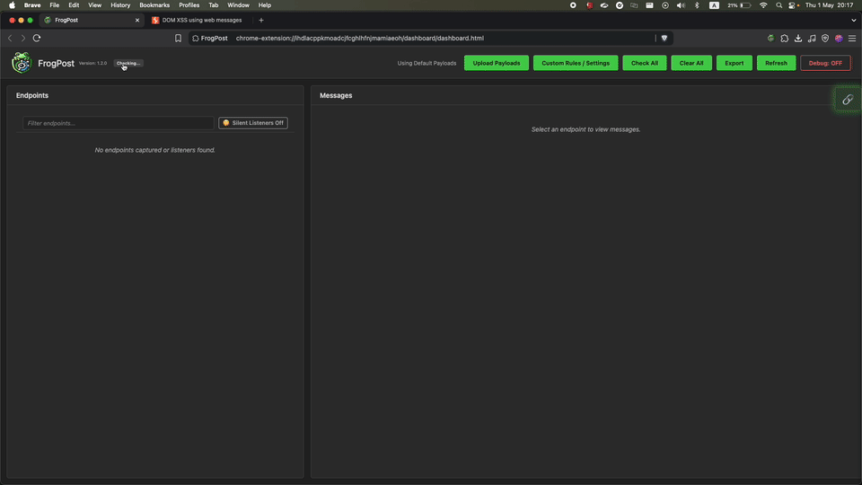

# FrogPost: postMessage Security Testing Tool

FrogPost is a Chrome extension for security testing of `postMessage` communications between iframes. It combines static analysis, dynamic testing, and optional AI assistance to identify vulnerabilities in message-handling implementations.

#### Current Version: FrogPost v3.0.1 🔥

## Preview
<p align="center" width="100%">
    
</p>

---

## ⚠️ Security Disclaimer

Use FrogPost **ethically and legally** — only test applications you own or have permission to assess.

---

## 🚀 Quick Start

### **Step 1: Load Extension**
1. Go to `chrome://extensions/` in Chrome
2. Enable **Developer mode** (top-right toggle)
3. Click **Load unpacked** and select the FrogPost folder
4. Copy the Extension ID from the extensions page

### **Step 2: Setup Server**
```bash
bash setup.sh
```
*This installs dependencies and sets up the local server for AI features*

### **Step 3: Start Using**
1. Visit any website with iframes
2. Click the FrogPost extension icon
3. Click **Analyze Handler** to detect vulnerabilities
4. Click **Launch Fuzzer** to test with payloads
5. Optional: Enable **Auto Pilot** for continuous automated scanning
6. Optional: Use **Upload URL List** for bulk endpoint testing

### **Step 4: Enable AI Features (Optional)**
1. Click extension icon → **Options**
2. Add your API key (OpenAI, Anthropic, Groq, or Mistral)
3. Start server: `bash setup.sh start`
4. Use **"Analyze with LLM"** for AI-powered insights

---

## 🎯 Core Features

- **Live Monitoring**: Captures `postMessage` traffic between iframes in real-time
- **Handler Analysis**: Detects and analyzes message handlers for vulnerabilities using runtime interception
- **Payload Testing**: Launches crafted payloads to test security
- **Auto Pilot Mode**: Automatically scans new endpoints as they appear, testing them without manual intervention
- **URL List Upload**: Bulk import and scan multiple URLs from a text file for automated testing
- **AI Enhancement**: Optional LLM-powered analysis (requires server)

### **What FrogPost Detects**
- Missing origin validation in message handlers
- Unsafe DOM sinks (innerHTML, eval, etc.)
- Prototype pollution vulnerabilities
- XSS injection points in postMessage handlers
- Security misconfigurations in iframe communication

### **Auto Pilot Mode**
Enable automated scanning for continuous monitoring:
1. Click the **Auto Pilot** toggle in the dashboard
2. FrogPost will automatically detect and scan new endpoints as they appear
3. Each endpoint is tested once with full handler analysis and fuzzing
4. Results are displayed in real-time without manual interaction

**Use Cases**:
- Continuous monitoring during application navigation
- Automated testing of dynamic iframe loading
- Hands-free security assessment of complex applications

### **URL List Upload**
Bulk test multiple endpoints efficiently:
1. Prepare a text file with one URL per line
2. Click **"Upload URL List"** in the dashboard
3. Select your file and let FrogPost process all URLs
4. All endpoints are opened, analyzed, and tested automatically

**Features**:
- Batch processing of hundreds of URLs
- Automatic tab management and cleanup
- Parallel endpoint scanning
- Results aggregation in the main dashboard

---

## 🖥️ Server Management

```bash
# Start server
bash setup.sh start

# Check status
bash setup.sh status

# Stop server
bash setup.sh stop
```

**Note**: Basic features work without the server, but AI analysis requires it to be running.

---

## 🤖 AI Features (Optional)

### **Supported Providers**
| Provider | Models | Cost |
|----------|--------|------|
| **OpenAI** | gpt-4o, gpt-4o-mini | ~$0.01-0.03 per analysis |
| **Anthropic** | claude-3-sonnet, claude-3-haiku | ~$0.01-0.02 per analysis |
| **Groq** | llama-3.1, mixtral-8x7b | ~$0.001-0.005 per analysis |
| **Mistral** | mistral-large, mistral-small | ~$0.005-0.015 per analysis |

### **Setup AI Features**
1. **Configure API Keys**: Click extension icon → Options
2. **Add your keys**: Choose any supported provider above
3. **Start server**: `bash setup.sh start`
4. **Use AI analysis**: Click "Analyze with LLM" in the dashboard

### **What AI Analysis Provides**
- **Handler Quality Score**: 0-100 accuracy rating
- **Security Assessment**: Detailed vulnerability analysis
- **Custom Payloads**: AI-generated payloads for detected sinks
- **Risk Recommendations**: Specific security improvements

---

## 🧪 Troubleshooting

| Issue | Solution |
|-------|----------|
| **❌ Server not running** | Run `bash setup.sh start` |
| **🔌 Connection failed** | Check if Node.js is installed |
| **📱 Extension not loading** | Enable Developer Mode in Chrome |
| **⚠️ Permission denied** | Run `chmod +x setup.sh` |
| **🤖 AI features not working** | Ensure server is running and API keys are configured |
| **🔑 API key errors** | Check key validity and provider selection |

### **Common Solutions**
- **Server won't start**: Check if port 1337 is available
- **Extension crashes**: Refresh the page and try again
- **No messages captured**: Ensure the site has iframe communication
- **Analysis fails**: Check browser console for error details
- **Auto Pilot not scanning**: Ensure endpoints are not in the ignored list and haven't been scanned already
- **URL Upload fails**: Verify file format (one URL per line, plain text)

---

## 📄 License

MIT License - see [LICENSE](LICENSE) for details.

---

## 🔗 Useful Links

- **GitHub Repository**: [github.com/thisis0xczar/FrogPost](https://github.com/thisis0xczar/FrogPost)
- **Bug Reports**: [GitHub Issues](https://github.com/thisis0xczar/FrogPost/issues)
- **Feature Requests**: [GitHub Discussions](https://github.com/thisis0xczar/FrogPost/discussions)

---

<p align="center">
    <b>🐸 Happy Security Testing! 🐸</b>
</p>

**Made with ❤️ by [thisis0xczar](https://github.com/thisis0xczar)**
